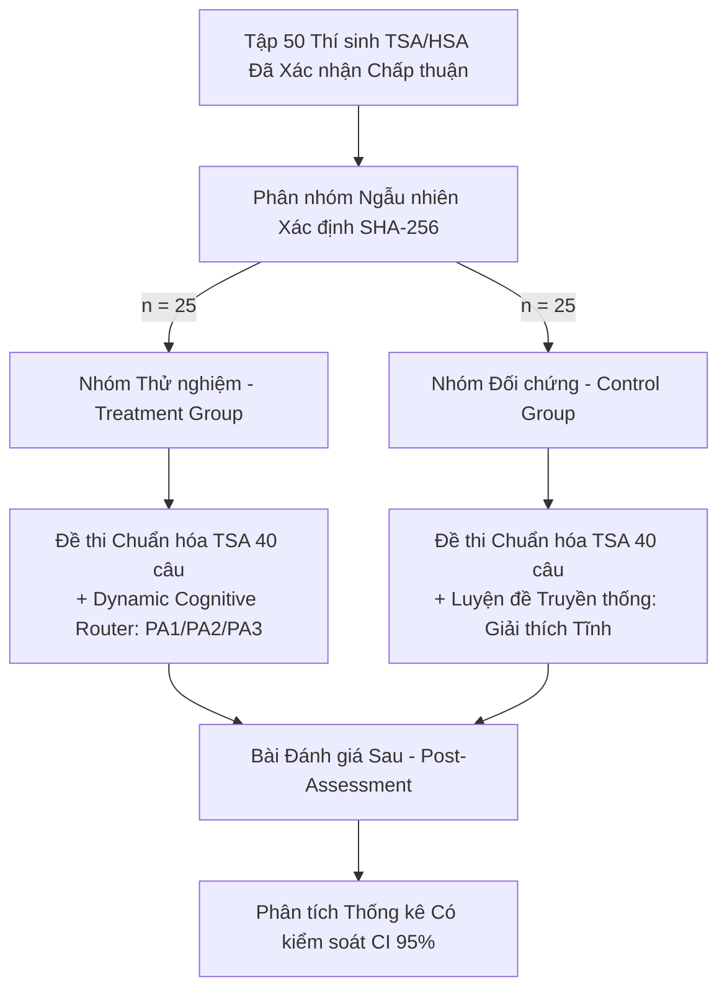

# KẾ HOẠCH PHÂN TÍCH THỬ NGHIỆM A/B CÓ ĐỐI CHỨNG (A/B TEST ANALYSIS PLAN)
**Dự án:** PUMKIN.DEV Closed Beta — Dynamic Cognitive Router  
**Cơ quan thiết kế:** Data & Experimentation Lead, Chief Academic AI Architect  
**Quy mô mẫu:** Tối đa $N = 50$ học sinh (25 Treatment, 25 Control)  
**Tình trạng đăng ký trước:** Pre-registered Protocol (Khóa trước khi thu thập dữ liệu)  

---

## 1. THIẾT KẾ THỬ NGHIỆM (EXPERIMENTAL DESIGN)

1. **Nhóm Thử nghiệm (Treatment Group - $n \le 25$):**
   - Học sinh làm bài trên hệ thống có tích hợp Dynamic Cognitive Router.
   - Khi gặp bế tắc hoặc dấu hiệu ngập ngừng, hệ thống tự động đề xuất 1 trong 3 can thiệp sư phạm: Thang gợi ý 4 bậc Socratic (`PA1`), Khung mô phỏng đồ thị trực quan Sandbox (`PA2`), hoặc Thử thách kỹ nghệ đảo ngược (`PA3`).
2. **Nhóm Đối chứng (Control Group - $n \le 25$):**
   - Học sinh làm cùng một bộ đề thi, cùng thời gian và điều kiện môi trường.
   - Khi cần trợ giúp, học sinh chỉ có thể mở lời giải chi tiết tĩnh theo phương pháp truyền thống.

---

## 2. CHỈ SỐ KẾT QUẢ ĐÃ ĐĂNG KÝ TRƯỚC (PRE-REGISTERED OUTCOMES)

### 2.1. Chỉ số Kết quả Chính (Primary Outcome)
- **Tỷ lệ vượt qua các câu hỏi bẫy nhận thức (Misconception Trap Mastery Rate):**
  - Định nghĩa: Tỷ lệ phần trăm làm đúng ở các câu hỏi được gắn cờ bẫy nhận thức điển hình (ví dụ: bẫy quên điều kiện xác định $\log_a b$, bẫy nhầm dấu bất phương trình khi cơ số $0 < a < 1$).
  - Mục tiêu kỳ vọng: Nhóm Treatment có tỷ lệ vượt bẫy cao hơn nhóm Control.

### 2.2. Các Chỉ số Phụ (Secondary Outcomes)
1. **Tỷ lệ Hoàn tất Bài thi (Completion Rate):** Tỷ lệ học sinh làm đủ 40 câu hỏi và bấm nộp bài thành công.
2. **Thời gian Tư duy Tích cực (Active-Thinking Proxy):** Thời gian dừng suy nghĩ có kiểm soát theo độ khó M1–M4, loại bỏ thời gian treo tab hoặc không tương tác.
3. **Chỉ số Đoán mò Ngẫu nhiên (Random-Guessing Proxy):** Tần suất chuyển đổi phương án nhanh ($< 3$ giây) nhiều lần liên tiếp.
4. **Mức độ Hữu ích của Trợ giảng Socratic:** Tỷ lệ học sinh giải quyết được câu hỏi sau khi chỉ mở gợi ý ở Bậc 1 hoặc Bậc 2 (không cần mở đến Bậc 4 - Lời giải đầy đủ).
5. **Độ ổn định Kỹ thuật:** Tỷ lệ lỗi JavaScript client ($< 0.1\%$) và tỷ lệ fallback ($< 1.0\%$).

---

## 3. PHƯƠNG PHÁP PHÂN TÍCH THỐNG KÊ (STATISTICAL METHODOLOGY)

1. **Báo cáo Khoảng Tin cậy (Confidence Interval - 95% CI):**
   - Do quy mô mẫu thí điểm nhỏ ($N = 50$), việc chỉ dựa vào giá trị $p$-value có nguy cơ sinh sai lầm loại II (False Negative) hoặc thổi phồng hiệu ứng.
   - Bắt buộc báo cáo chỉ số kích thước hiệu ứng (Effect Size - Cohen's $d$ hoặc Hedges' $g$) kèm theo khoảng tin cậy 95% CI:
     $$\Delta = \bar{X}_{\text{treatment}} - \bar{X}_{\text{control}} \pm 1.96 \times SE$$
2. **Cảnh báo Giới hạn Nghiên cứu (Statistical Limitations):**
   - Nếu khoảng tin cậy quá rộng (ví dụ: $95\% \text{ CI} = [-2\%, +28\%]$), kết luận bắt buộc phải ghi rõ: *"Chưa đủ bằng chứng thống kê vững chắc để khẳng định ưu thế tuyệt đối, cần tiếp tục mở rộng quy mô mẫu"*.
   - Tuyệt đối không thay đổi Primary Metric sau khi đã mở dữ liệu nhằm tránh hiện tượng $p$-hacking.
