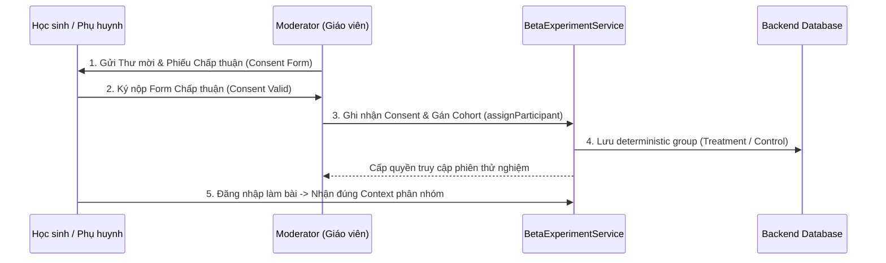

# QUY TRÌNH TIẾP NHẬN & QUẢN TRỊ HỌC SINH CLOSED BETA (50 THÍ SINH)
**Mã tài liệu:** `DOC-BETA-ONBOARDING-01`  
**Dự án:** PUMKIN.DEV Dynamic Cognitive Router & Deep Learning Engine  
**Cơ quan ban hành:** Ban Quản trị Kỹ thuật & Hội đồng Đào tạo TSA/HSA  

---

## 1. NGUYÊN TẮC TIẾP NHẬN (ONBOARDING PRINCIPLES)
1. **Kiểm soát chặt chẽ:** Chỉ tiếp nhận tối đa 50 học sinh có nguyện vọng ôn thi Đánh giá Tư duy (TSA - ĐHBK Hà Nội) hoặc Đánh giá Năng lực (HSA - ĐHQG Hà Nội).
2. **Không tự động tuyển mộ:** Tuyệt đối không gửi email/tin nhắn spam hoặc mở tự do ngoài danh sách được duyệt.
3. **Phân nhóm ngẫu nhiên xác định (Deterministic A/B Assignment):**
   - **Nhóm Thử nghiệm (Treatment - 25 học sinh):** Kích hoạt Dynamic Cognitive Router (can thiệp PA1 Socratic Scaffolding, PA2 Interactive Sandbox, PA3 Reverse Challenge).
   - **Nhóm Đối chứng (Control - 25 học sinh):** Giữ nguyên giao diện luyện đề truyền thống, giải thích tĩnh chuẩn mực.
   - Cơ chế phân nhóm thực hiện server-side bằng hàm băm SHA-256 trên `cohortId + ":" + userId`, cam kết không bị nhảy nhóm giữa chừng.

---

## 2. QUY TRÌNH 5 BƯỚC THỰC HIỆN



### Bước 1: Sàng lọc & Xác nhận Thỏa thuận
- Điều phối viên gửi mẫu thỏa thuận tham gia thử nghiệm (`docs/consent-and-data-handling.md`).
- Đối với học sinh dưới 18 tuổi, bắt buộc có chữ ký đồng thuận của phụ huynh hoặc người giám hộ hợp pháp.

### Bước 2: Nhập liệu & Cấp quyền Hệ thống (Server-Authoritative)
- Moderator đăng nhập vào Admin Console hoặc gọi API:
  ```http
  POST /api/beta/assign
  Content-Type: application/json
  Authorization: Bearer <ADMIN_SESSION_TOKEN>

  {
    "cohortId": "cognitive-beta-2026-01",
    "userId": "user_tsa_042"
  }
  ```
- Hệ thống tự động ghi nhận nhật ký kiểm toán (Audit Log) lưu rõ thời điểm và người thực hiện.

### Bước 3: Xác thực Trạng thái Chấp thuận (Consent Status Gating)
- Gọi API lưu trạng thái consent:
  ```http
  POST /api/beta/consent
  {
    "cohortId": "cognitive-beta-2026-01",
    "userId": "user_tsa_042",
    "consentData": {
      "consentGiven": true,
      "version": "1.0",
      "guardianConsent": true
    }
  }
  ```
- **Ràng buộc an toàn:** Nếu học sinh chưa có bản ghi consent hợp lệ (`status !== "valid"`), hệ thống sẽ **tự động vô hiệu hóa toàn bộ telemetry nghiên cứu** và đưa học sinh về luồng luyện đề chuẩn.

### Bước 4: Hướng dẫn Thí nghiệm cho Học sinh
- Cung cấp tài khoản trải nghiệm đã được phân quyền.
- Hướng dẫn học sinh sử dụng các công cụ tương tác: cách mở các tầng gợi ý Socratic (4 bậc), cách kéo thanh trượt thông số trên Interactive Sandbox, và cách gửi bài thử thách thiết kế đề thi.

### Bước 5: Giám sát Phiên và Hỗ trợ Kỹ thuật
- Giám sát qua Telemetry Analytics Dashboard (`/admin/cognitive-telemetry.html`).
- Nếu phát hiện bất thường, Moderator có quyền kích hoạt tạm ngừng cá nhân qua API `deactivateParticipant()` hoặc ngắt diện rộng qua `Kill Switch`.
