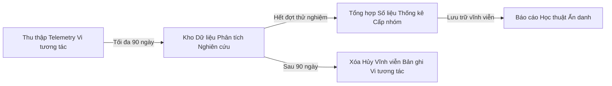

# CHÍNH SÁCH LƯU TRỮ DỮ LIỆU & QUY TRÌNH RÚT LUI KHỎI THỬ NGHIỆM (RETENTION & WITHDRAWAL)
**Dự án:** PUMKIN.DEV Closed Beta — Dynamic Cognitive Router  
**Tài liệu tham chiếu:** `docs/consent-and-data-handling.md`, `docs/privacy-audit-checklist.md`  

---

## 1. CHÍNH SÁCH LƯU TRỮ & VÒNG ĐỜI DỮ LIỆU (DATA RETENTION POLICY)

Dữ liệu thu thập trong khuôn khổ thử nghiệm Closed Beta tuân thủ quy tắc vòng đời có giới hạn nghiêm ngặt:



1. **Dữ liệu Vi tương tác Thô (Raw Micro-telemetry):**
   - Lưu trữ tối đa **90 ngày** kể từ ngày kết thúc ca thử nghiệm cuối cùng.
   - Định kỳ mỗi 30 ngày, script dọn dẹp hệ thống sẽ quét các bản ghi có `timestamp` vượt quá 90 ngày để tiến hành xóa cứng (Hard Delete).
2. **Dữ liệu Thống kê Cấp Nhóm (Aggregated Cohort Metrics):**
   - Chỉ giữ lại các chỉ số trung bình (Mean rigor, hesitation distribution, completion rate).
   - Tuyệt đối không chứa bất kỳ khóa định danh người dùng nào, kể cả mã định danh giả danh (`anonymousParticipantId`).
   - Được lưu trữ phục vụ các công bố khoa học giáo dục và báo cáo nghiệm thu của Hội đồng Học thuật.

---

## 2. QUY TRÌNH XỬ LÝ YÊU CẦU RÚT LUI (PARTICIPANT WITHDRAWAL WORKFLOW)

Khi một học sinh hoặc phụ huynh học sinh yêu cầu ngừng tham gia Closed Beta và hủy bỏ dữ liệu:

### Bước 1: Tiếp nhận Yêu cầu Rút lui
- Moderator tiếp nhận yêu cầu qua kênh hỗ trợ chính thức.
- Xác thực thông tin tài khoản yêu cầu rút lui.

### Bước 2: Thu hồi Quyền Thử nghiệm (Revocation)
- Gọi API hệ thống để đổi trạng thái sang `withdrawn` và `revoked`:
  ```http
  POST /api/beta/revoke
  Content-Type: application/json
  Authorization: Bearer <ADMIN_TOKEN>

  {
    "cohortId": "cognitive-beta-2026-01",
    "userId": "user_tsa_042",
    "reason": "Học sinh yêu cầu rút lui theo nguyện vọng cá nhân"
  }
  ```
- **Hệ quả tức thì:**
  - Nếu học sinh đang trong phiên làm bài, hệ thống lập tức tắt Dynamic Cognitive Router và chuyển sang giao diện ôn luyện tiêu chuẩn mà không làm mất bài thi.
  - Mọi sự kiện phát sinh từ thời điểm này sẽ không được ghi vào tệp telemetry nghiên cứu.

### Bước 3: Xóa Dữ liệu Vi tương tác Đã thu thập (Data Erasure)
- Kích hoạt phương thức xóa toàn diện:
  `BetaExperimentService.deleteParticipantData(anonymousParticipantId)`
- Toàn bộ các dòng bản ghi có chứa mã định danh giả danh này trong `telemetry_events.json` sẽ bị xóa hoàn toàn.
- Hệ thống ghi lại một dòng Audit Log:
  ```json
  {
    "action": "PURGE_PARTICIPANT_DATA",
    "actorId": "admin_moderator_01",
    "details": {
      "anonymousParticipantId": "anon_9f83ab201c890ef4",
      "purgedEventCount": 24
    }
  }
  ```

---

## 3. XUẤT BÁO CÁO DÀNH CHO HỘI ĐỒNG HỌC THUẬT (ACADEMIC EXPORT)
- Báo cáo xuất phục vụ Hội đồng Học thuật chỉ xuất ở định dạng thống kê nhóm (CSV/JSON aggregate).
- Không bao gồm token, secret, thông tin cá nhân hoặc các phản hồi tự do chưa được xử lý.
- Mọi trường dữ liệu đều được thẩm định bởi EdTech Privacy Reviewer trước khi chuyển giao.
