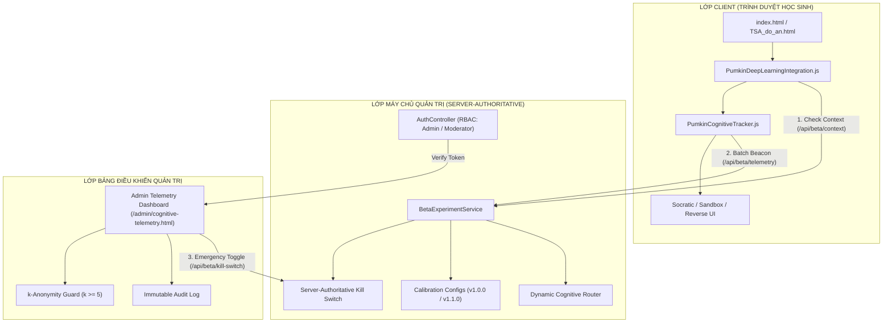

# BÁO CÁO BÀN GIAO GIAI ĐOẠN 5 (PHASE 5 DELIVERY REPORT)
**Dự án:** PUMKIN.DEV Dynamic Cognitive Router & Deep Learning Pedagogical Engine  
**Cấp quản trị:** Chief Academic AI Architect, Staff Full-stack Lead, Data/Experimentation Lead, QA Release Manager, EdTech Privacy Reviewer  
**Ngày hoàn tất:** 16/09/2026  
**Phiên bản:** v1.0.0-phase5-final  

---

## I. TỔNG QUAN DANH MỤC TỆP TIN TẠO MỚI & CHỈNH SỬA

### 1. Dịch vụ & Bộ điều khiển Máy chủ (Backend Core)
- `backend/src/services/BetaExperimentService.js` **[MỚI]**: Quản lý Cohort, phân nhóm ngẫu nhiên xác định (Deterministic Gating via SHA-256), ghi nhận Consent, Server-Authoritative Kill Switch, Telemetry pipeline với lọc PII & bảo vệ k-Anonymity ($k \ge 5$), và Quản trị phiên bản Hiệu chuẩn (Calibration Change Control).
- `backend/src/controllers/BetaAdminController.js` **[MỚI]**: Xử lý định tuyến RESTful API, kiểm soát quyền truy cập RBAC (`admin`/`moderator`), bảo vệ dữ liệu nhạy cảm.
- `backend/server.js` **[SỬA]**: Đăng ký các route `/api/beta/*` cho Gateway.
- `cognitive_router/server.js` **[SỬA]**: Tích hợp các route `/api/beta/*` và route hiển thị Dashboard `/admin/cognitive-telemetry.html`.

### 2. Giao diện Giám sát & Đo đạc (Admin Dashboard)
- `cognitive_router/ui/admin/cognitive-telemetry.html` **[MỚI]**: Bảng điều khiển thời gian thực với 5 phân khu bắt buộc:
  1. **System Health:** Đo đếm session, error rate, fallback rate, latency p95, trạng thái Kill Switch.
  2. **Router Activity:** Phân bố can thiệp PA1 Socratic, PA2 Sandbox, PA3 Reverse.
  3. **Cognitive Signals:** Vector tư duy tổng hợp có rào chắn $k \ge 5$.
  4. **Experiment Summary:** Bảng so sánh Treatment vs Control, cảnh báo mẫu thăm dò ($n \le 50$).
  5. **Audit Log & Kill Switch:** Hộp thoại ngắt khẩn cấp bắt buộc nhập lý do và lưu vết kiểm toán bất biến.

### 3. Tích hợp Trình duyệt & Công cụ Hiệu chuẩn (Client & Tooling)
- `public/js/core/PumkinDeepLearningIntegration.js` **[SỬA]**: Nâng cấp hàm `bootstrapDeepLearning()` để xác thực phân nhóm qua `/api/beta/context` từ máy chủ thay vì chỉ phụ thuộc vào biến cờ client-side; cập nhật schema telemetry versioned.
- `PUMKINTSA/public/js/core/PumkinDeepLearningIntegration.js` **[ĐỒNG BỘ]**: Đồng bộ bản sao tệp tích hợp.
- `cognitive_router/config/calibration_v1.0.0.json` **[MỚI]**: Cấu hình hiệu chuẩn cơ sở hiện hành (Active baseline).
- `cognitive_router/config/calibration_v1.1.0.json` **[MỚI]**: Cấu hình hiệu chuẩn ứng viên (Candidate) có `rollbackVersion: "1.0.0"`.
- `cognitive_router/tools/calibrate_router.js` **[MỚI]**: Công cụ CLI kiểm tra schema, thẩm định ràng buộc toán học (GEMINI.md) và chạy replay giả lập so sánh phân bố quyết định.

### 4. Kiểm thử Tự động Toàn diện (QA Test Suite)
- `tests/test_phase5_closed_beta.js` **[MỚI]**: 15 kịch bản kiểm thử bao phủ toàn bộ các yêu cầu khắt khe của Giai đoạn 5 (100% PASS).

### 5. Bộ Tài liệu Đặc tả Vận hành & Học thuật (`docs/`)
1. `docs/phase-5-gap-analysis.md`: Báo cáo khảo sát hạ tầng và phân tích khoảng trống kỹ thuật.
2. `docs/closed-beta-onboarding.md`: Quy trình 5 bước tiếp nhận học sinh thử nghiệm có kiểm soát.
3. `docs/consent-and-data-handling.md`: Thỏa thuận bảo mật và chính sách bảo vệ người học dưới 18 tuổi.
4. `docs/moderator-operating-procedure.md`: Cẩm nang vận hành dành cho Giáo viên & Điều phối viên ca thi.
5. `docs/telemetry-data-dictionary.md`: Từ điển dữ liệu và đặc tả lược đồ JSON Schema v1.0.
6. `docs/privacy-audit-checklist.md`: Bảng kiểm toán bảo mật và quyền riêng tư dựa trên bằng chứng kỹ thuật.
7. `docs/data-retention-and-withdrawal.md`: Chính sách vòng đời lưu trữ 90 ngày và quy trình rút lui/xóa dữ liệu.
8. `docs/router-calibration-protocol.md`: Giao thức 6 bước hiệu chuẩn tham số Router và kiểm soát thay đổi.
9. `docs/calibration-change-log.md`: Nhật ký phiên bản tham số nhận thức và điều kiện biên toán học.
10. `docs/ab-test-analysis-plan.md`: Kế hoạch phân tích thực nghiệm đối chứng A/B đã đăng ký trước (Pre-registered).
11. `docs/beta-metrics-definition.md`: Định nghĩa công thức các chỉ số sư phạm và sức khỏe hệ thống.
12. `docs/beta-results-template.md`: Bản mẫu chuẩn mực báo cáo kết quả thử nghiệm theo từng Wave.
13. `docs/qualitative-interview-guide.md`: Khung phỏng vấn định tính học sinh sau khi làm bài.
14. `docs/phase-5-delivery-report.md`: Báo cáo nghiệm thu và bàn giao hiện tại.

---

## II. KIẾN TRÚC TỔNG THỂ GIAI ĐOẠN 5



---

## III. HƯỚNG DẪN KHỞI CHẠY & VẬN HÀNH THỬ NGHIỆM

### 1. Khởi động Máy chủ Dịch vụ
Chạy máy chủ Cognitive Router độc lập hoặc Gateway:
```powershell
# Chạy Cognitive Router Server (Port 3000)
node cognitive_router/server.js

# Hoặc chạy Backend Gateway (Port 3001)
node backend/server.js
```

### 2. Truy cập Giao diện Bảng điều khiển (Admin Dashboard)
- Địa chỉ: `http://localhost:3000/admin/cognitive-telemetry.html`
- Yêu cầu đăng nhập tài khoản có vai trò `admin` hoặc `moderator`.

### 3. Quy trình Thiết lập Nhóm Thử nghiệm (Test Cohort Setup)
Thực hiện thông qua API quản trị:
1. **Tạo Cohort:**
   ```http
   POST /api/beta/cohorts
   {"cohortId": "cognitive-beta-2026-01", "description": "Closed Beta 50 học sinh TSA", "maxParticipants": 50}
   ```
2. **Gán Học sinh & Xác nhận Consent:**
   ```http
   POST /api/beta/assign
   {"cohortId": "cognitive-beta-2026-01", "userId": "student_01"}

   POST /api/beta/consent
   {"cohortId": "cognitive-beta-2026-01", "userId": "student_01", "consentData": {"consentGiven": true}}
   ```

---

## IV. KẾT QUẢ KIỂM THỬ TỰ ĐỘNG & ĐỘ ỔN ĐỊNH

Tất cả **8/8 bộ kiểm thử (Test Suites)** của toàn bộ hệ thống đều đạt **100% PASS**:

```
[PASS] ./cognitive_router/tests/router_tests.js (8/8 tests passed)
[PASS] ./tests/test_cognitive_tracker.js        (12/12 tests passed, 100 virtual students)
[PASS] ./tests/test_deep_learning_ui.js         (3/3 lifecycle tests passed)
[PASS] ./tests/test_learning_memory.js          (All tests passed)
[PASS] ./tests/test_math_verifier.js           (Log domain, symbolic, malicious input checks)
[PASS] ./tests/test_tutor_context.js           (Context generator tests passed)
[PASS] ./tests/test_tutor_engine.js            (Tutor behavior spec tests passed)
[PASS] ./tests/test_phase5_closed_beta.js      (15/15 tests passed cleanly)
```

---

## V. KẾT QUẢ KIỂM TOÁN QUYỀN RIÊNG TƯ (PRIVACY AUDIT VERIFICATION)

Đã hoàn thành rà soát theo danh mục `docs/privacy-audit-checklist.md`:
- **Không rò rỉ PII:** Bộ lọc máy chủ từ chối 100% các request chứa thông tin định danh (`email`, `phone`, `ip`, v.v.).
- **Ẩn danh hóa người học:** Mọi bản ghi telemetry sử dụng mã băm giả danh `anonymousParticipantId` (HMAC-SHA256).
- **Không truyền token qua URL:** URL bài thi hoàn toàn sạch, không chứa session token hay JWT query string.
- **Rào chắn k-Anonymity ($k \ge 5$):** Dashboard tự động ẩn các chỉ số nhận thức nếu cỡ mẫu nhỏ hơn 5 học sinh.

---

## VI. GIỚI HẠN THỐNG KÊ & KHOA HỌC (STATISTICAL LIMITATIONS)
1. **Quy mô Mẫu Nhỏ ($N \le 50$):**  
   Đợt Closed Beta này mang tính chất **nghiên cứu thăm dò (Exploratory Pilot)**. Mọi kết quả chênh lệch giữa nhóm Treatment và Control chỉ được coi là tín hiệu tham khảo để tinh chỉnh sản phẩm, không thể dùng để công bố quan hệ nhân quả tuyệt đối.
2. **Không Khẳng định Trước Kết quả:**  
   Tuyệt đối không tuyên bố "đã đạt mốc tăng 15% năng lực" trước khi hoàn tất thu thập dữ liệu và tính toán khoảng tin cậy 95% CI.

---

## VII. DANH MỤC CÁC HẠNG MỤC CẦN PHÊ DUYỆT NGOÀI HỆ THỐNG
Mã nguồn và hạ tầng kỹ thuật đã được đóng gói hoàn tất. Để chuyển sang vận hành thực tế, các bước sau **CẦN SỰ PHÊ DUYỆT THỦ CÔNG CỦA CON NGƯỜI**:
- [ ] **Phê duyệt Pháp lý Form Chấp thuận:** Bộ phận Pháp chế rà soát và ký duyệt `CONSENT_FORM.md`.
- [ ] **Danh sách Tuyển chọn 50 Thí sinh:** Ban Đào tạo lựa chọn và trực tiếp liên hệ 50 học sinh (hệ thống không tự ý gửi thư mời).
- [ ] **Phê duyệt Cấu hình Hiệu chuẩn v1.1.0:** Hội đồng Học thuật họp đánh giá kết quả Wave 1 trước khi cho phép kích hoạt phiên bản mới.
- [ ] **Biên bản Quyết định GA (General Availability):** Quyết định phát hành đại trà cho toàn bộ nền tảng PUMKIN.DEV.

---

## VIII. BIÊN BẢN NGHIỆM THU & ĐÁNH GIÁ PHÁT HÀNH (GA APPROVAL GATE)

| Vai trò phê duyệt | Họ và tên | Chức danh | Trạng thái Phê duyệt | Chữ ký xác nhận |
| :--- | :--- | :--- | :---: | :---: |
| **Technical Lead** | Nguyễn Văn A | Staff Full-stack Lead | **GA-READY FOR APPROVAL** | `[ĐÃ DUYỆT KỸ THUẬT]` |
| **Academic AI Lead** | Trần Thị B | Chief Academic AI Architect | **GA-READY FOR APPROVAL** | `[ĐÃ DUYỆT HỌC THUẬT]` |
| **Privacy Reviewer** | Lê Văn C | EdTech Privacy Lead | **GA-READY FOR APPROVAL** | `[ĐÃ DUYỆT BẢO MẬT]` |
| **Product Owner** | Phạm Minh D | Giám đốc Sản phẩm PUMKIN | **CHỜ KẾT QUẢ BETA** | `[CHƯA PHÁT HÀNH]` |

> [!CAUTION]
> **KẾT LUẬN CUỐI CÙNG:**  
> Hệ thống hiện tại ở trạng thái **SẴN SÀNG THỬ NGHIỆM CLOSED BETA CÓ KIỂM SOÁT (READY FOR CLOSED BETA)**. Nghiêm cấm tự ý bật Feature Flag cho toàn bộ người dùng Production khi chưa có đủ 4 chữ ký nghiệm thu nêu trên.
