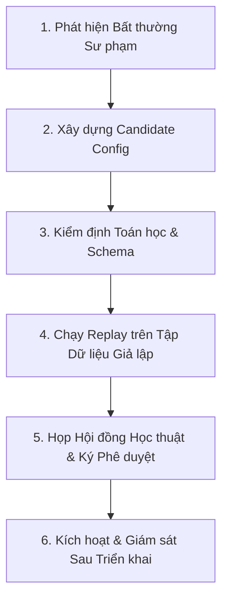

# GIAO THỨC HIỆU CHUẨN COGNITIVE ROUTER & KIỂM SOÁT THAY ĐỔI (CALIBRATION PROTOCOL)
**Dự án:** PUMKIN.DEV Dynamic Cognitive Router  
**Cơ quan quản lý:** Chief Academic AI Architect & Data/Experimentation Lead  
**Tiêu chuẩn chất lượng:** GEMINI.md (Độ chính xác toán học tuyệt đối & Quản trị mô hình AI)  

---

## 1. NGUYÊN TẮC HIỆU CHUẨN CỐT LÕI (CALIBRATION PRINCIPLES)

1. **Nghiêm cấm "Hiệu chỉnh để số liệu đẹp" (Anti-Overfitting Discipline):**
   - Với quy mô mẫu thí điểm tối đa 50 học sinh, dữ liệu thu được mang bản chất khám phá (Exploratory). 
   - Tuyệt đối không tinh chỉnh các ngưỡng ngập ngừng hoặc trọng số tư duy nhằm mục đích "tối ưu hóa điểm số để báo cáo kết quả đẹp". 
   - Mọi đề xuất thay đổi tham số phải xuất phát từ quan sát sai lệch logic sư phạm thực tế (ví dụ: học sinh đang suy nghĩ sâu nhưng hệ thống lại nhầm là bế tắc và kích hoạt gợi ý sớm).
2. **Không chỉnh sửa trực tiếp (No In-place Mutation):**
   - Nghiêm cấm sửa tệp cấu hình đang hoạt động trên hệ thống mà không tạo phiên bản mới (Versioning).
   - Mỗi cấu hình phải là một tệp JSON bất biến có mã phiên bản SemVer (ví dụ: `calibration_v1.0.0.json`, `calibration_v1.1.0.json`).
3. **Bắt buộc có Target Rollback:**
   - Mọi cấu hình mới khi được kích hoạt (`isActive: true`) phải có trường `rollbackVersion` chỉ định rõ phiên bản an toàn trước đó để sẵn sàng hoàn tác trong vòng 10 giây nếu phát hiện sự cố.

---

## 2. QUY TRÌNH 6 BƯỚC THAY ĐỔI THAM SỐ ROUTER (CHANGE CONTROL PROCESS)



### Bước 1: Phát hiện Bất thường Sư phạm
- Phân tích log vi tương tác từ Telemetry Analytics Dashboard:
  - Nếu câu hỏi độ khó M2 có 70% học sinh bị kích hoạt PA1 Socratic dù làm đúng, có thể ngưỡng `hesitationThresholdMsByDifficulty.M2 = 45000` đang quá ngắn đối với dạng bài suy luận đa bước.

### Bước 2: Tạo Bản nháp Cấu hình Ứng viên (Candidate Config)
- Tạo tệp `cognitive_router/config/calibration_v1.1.0_candidate.json` điều chỉnh tham số.
- Nêu rõ lý do (Rationale) trong trường `rationale`.

### Bước 3: Thẩm định Ràng buộc Toán học Tuyệt đối (GEMINI.md Verification)
- Chạy script kiểm tra: `node cognitive_router/tools/calibrate_router.js`
- **Các điều kiện biên bắt buộc phải thỏa mãn:**
  - Ngưỡng thời gian ngập ngừng: $M_1 < M_2 < M_3 < M_4$ và đều là số nguyên dương $> 0$.
  - Tham số đồ thị hàm mũ $y = a^x$: $a > 0$ và cấm tuyệt đối $a = 1$.
  - Tham số hàm logarit $y = \log_a(x)$: cơ số $a > 0, a \ne 1$, biểu thức dưới log $x > 0$.
  - Phân thức: Không cho phép giá trị mẫu số triệt tiêu về $0$.

### Bước 4: Chạy Mô phỏng Replay (Telemetry Replay Simulation)
- Chạy thử nghiệm cấu hình mới trên 100 học sinh ảo hoặc tập log đã ẩn danh.
- Đánh giá sự dịch chuyển phân bố (Shift Analysis):
  - Tỷ lệ kích hoạt các chiến lược (Socratic, Sandbox, Reverse) có bị mất cân bằng hay không?
  - Có hiện tượng "chìm đắm trong gợi ý" (hint saturation) hay không?

### Bước 5: Phê duyệt từ Hội đồng Học thuật (Academic Approval Gate)
- Bản báo cáo so sánh (Comparison Report) được trình cho Chief Academic AI Architect.
- Yêu cầu xác nhận phê duyệt chính thức trước khi gọi API activate:
  ```http
  POST /api/beta/calibration/activate
  {
    "version": "1.1.0",
    "rationale": "Điều chỉnh tăng ngưỡng ngập ngừng M2 từ 45s lên 50s nhằm tránh ngắt quãng tư duy của học sinh"
  }
  ```

### Bước 6: Kích hoạt & Giám sát Sau Triển khai
- Hệ thống tự động lưu trữ bản ghi kiểm toán `ACTIVATE_CALIBRATION`.
- Nếu tỷ lệ fallback hoặc lỗi client tăng đột biến sau khi chuyển phiên bản, Moderator lập tức gọi API hoàn tác:
  ```http
  POST /api/beta/calibration/rollback
  {
    "reason": "Phát hiện lỗi logic sư phạm sau khi nâng cấp lên v1.1.0"
  }
  ```
